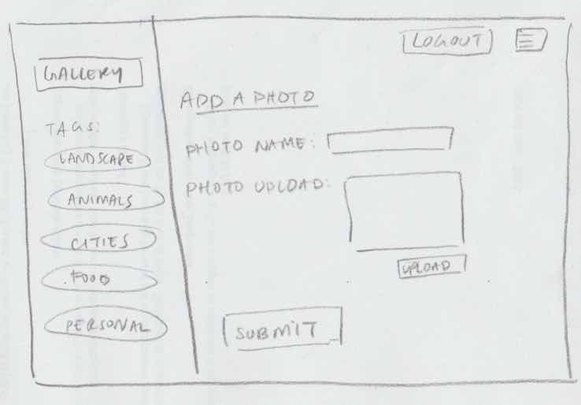

# Project 3 - Design & Plan

Your Name: Aileen Cai ac952

## 1. Persona

I've selected **[Abby]** as my persona.

I've selected my persona because... [Tell us why you picked your persona in 1-3 sentences.]

I've selected my persona because her motivations and attitudes toward technology is parallel to mine. My information processing style is also "burst-y" so I feel that our similarities would help me design a webpage that would be more user friendly to her.

## 2. Sketches & Wireframes

### Sketches

[Insert your sketches here.]


### Wirefames

[Insert your wireframes here.]





[Explain why your design would be effective for your persona. 1-3 sentences.]
My sketches meet the need of my personal because it is simple and intuitive.
Since Abby is risk averse and has low confidence about doing unfamiliar tasks,
I decided to place the login at the top of the home page only. All of the
 options on the gallery(side bar) will be present at every
page so that she won't have to look for the back button.

## 3. Database Schema Plan

[Describe the structure of your database. You may use words or a picture.
A bulleted list is probably the simplest way to do this.]

In my database, I will have two tables. One primarily for the photos and
another for the tags. The photos table will contain an id and name of the photo.
 The tags table will also contain an id and photo_id as the foreign key. Each
 field and their types are listed below.

Table: photos
* field 1: id INTEGER {PRIMARY KEY, NOT NULL, AUTO INCREMENT,UNIQUE}
* field 2: photo_name TEXT {NOT_NULL}
* field 3: photo_img BLOB {NOT NULL}

Table: tags
* field 1: id PRIMARY KEY, NOT NULL, AUTO INCREMENT,UNIQUE
* field 2: tag_name TEXT {NOT_NULL}
* field 3: photos_id BLOB {NOT NULL}

## 4. Database Query Plan

[Plan your database queries. You may use natural language, pseudocode, or SQL.]
1. All records
SQL: SELECT * FROM photos;
2. Search photo by name
SQL: "SELECT photo_img FROM photos WHERE photo_name = "waterfall.jpeg";
3. Search photo by tags
SQL: "SELECT photo_img FROM tags WHERE photos_id = 1;


## 5. Structure and Pseudocode

### Structure

[List the PHP files you will have. You will probably want to do this with a bulleted list.]

* index.php - main page.
* includes/init.php - stuff that useful for every web page.
* includes/header.php - navigation bar for each page
* gallery.php - contains a page with all the photos
* landscape.php - (tag)contains a page with landscape photos
* personal.php - (tag)contains a page with personal photos
* animals.php -(tag)contains a page with animal photos
* food.php -(tag)contains a page with food photos
* cities.php -(tag)contains a page with city photos
* login.php - login form page
* logout.php - logout page
* addphoto.php - upload photo form


### Pseudocode

[For each PHP file, plan out your pseudocode. You probably want a subheading for each file.]

#### index.php

```
include init.php
create page id for the index page
welcome screen using html and static photos in processing
button on right hand corner to log in.
```

#### includes/init.php

```
make an array for pages
messages = array to store messages for user (you may remove this)

// DB helper functions (you do not need to write this out since they are provided.)
db = connect to db
make function for executing sql with params $db, $sql, $params
try: set query to prepare sql
if there is sql and query executes params
return the Query
otherwise, catch the Pdo exception and handle the error
else return null

make function open_or_init_sqlite_db to check if sqlfile exists
($db_filename, $init_sql_filename)
if the file exists with $db_Filename as the argument,
then db = connect the DB

set $db_init_sql to contain file contents
if $db_init_sql returns file contents then execute it
return the result
otherwise catch the exception error and handle it
else return null value
...

```

#### includes/header.php - navigation bar for each page
```
navigation bar using html and php
for loop $pages as $page_id => page_name
if the page id is equal to the $current_page_id
then set the id to the current page
else set it to empty string
echo link of the page by getting page_id
```

#### gallery.php - contains a page with all the photos
```
include init.php
create gallery page id
create a connection to the sql Database
$db = open_or_init_sqlite_db('photogallery.sqlite', "init/init.sql");
make a function to execute the sql query,
try: set query to prepare sql
if there is sql and query executes params
return the Query
otherwise, catch the Pdo exception and handle the error
return null if query not returned

function for getting the text(photo title) and photo_img
echo the text by filtering (escape output)

make a function to get all the photos from sql
$sql =  "SELECT * FROM photos;
$params = array();


```

#### landscape.php - (tag)contains a page with landscape photos
```
include init.php
create landscape page id
create a connection to the sql Database
$db = open_or_init_sqlite_db('photogallery.sqlite', "init/init.sql");
make a function to execute the sql query,
try: set query to prepare sql
if there is sql and query executes params
return the Query
otherwise, catch the Pdo exception and handle the error
return null if query not returned

function for getting the text(photo title) and photo_img
echo the text by filtering (escape output)

make a function to get only photos_id from the tagged photo
$sql= "SELECT photo_img FROM tags WHERE photos_id = 1;
$params = array();
```

#### personal.php - (tag)contains a page with personal photos
```
include init.php
create personal page id
create a connection to the sql Database
$db = open_or_init_sqlite_db('photogallery.sqlite', "init/init.sql");
make a function to execute the sql query,
try: set query to prepare sql
if there is sql and query executes params
return the Query
otherwise, catch the Pdo exception and handle the error
return null if query not returned

function for getting the text(photo title) and photo_img
echo the text by filtering (escape output)

make a function to get only photos_id from the tagged photo
$sql= "SELECT photo_img FROM tags WHERE photos_id = 2;
$params = array();
```

#### animals.php -(tag)contains a page with animal photos
```
include init.php
create animals page id
create a connection to the sql Database
$db = open_or_init_sqlite_db('photogallery.sqlite', "init/init.sql");
make a function to execute the sql query,
try: set query to prepare sql
if there is sql and query executes params
return the Query
otherwise, catch the Pdo exception and handle the error
return null if query not returned

function for getting the text(photo title) and photo_img
echo the text by filtering (escape output)

make a function to get only photos_id from the tagged photo
$sql= "SELECT photo_img FROM tags WHERE photos_id = 3;
$params = array();
```

#### food.php -(tag)contains a page with food photos
```
include init.php
create food page id
create a connection to the sql Database
$db = open_or_init_sqlite_db('photogallery.sqlite', "init/init.sql");
make a function to execute the sql query,
try: set query to prepare sql
if there is sql and query executes params
return the Query
otherwise, catch the Pdo exception and handle the error
return null if query not returned

function for getting the text(photo title) and photo_img
echo the text by filtering (escape output)

make a function to get only photos_id from the tagged photo
$sql= "SELECT photo_img FROM tags WHERE photos_id = 4;
$params = array();
```

#### cities.php -(tag)contains a page with city photos
```
include init.php
Create cities page id
create a connection to the sql Database
$db = open_or_init_sqlite_db('photogallery.sqlite', "init/init.sql");
make a function to execute the sql query,
try: set query to prepare sql
if there is sql and query executes params
return the Query
otherwise, catch the Pdo exception and handle the error
return null if query not returned

function for getting the text(photo title) and photo_img
echo the text by filtering (escape output)

make a function to get only photos_id from the tagged photo
$sql= "SELECT photo_img FROM tags WHERE photos_id = 5;
$params = array();
```

#### login.php - login form page
```
include init.php
set a login page id
html form with text inputs:
username:
password:
and submit button
```

#### logout.php - logout page
```
include init.php
message to user that they have logged logout
```

#### addphoto.php - upload photo form
```
include init.php
set page id= add photos
create a connection to the sql database created
$db = open_or_init_sqlite_db('photogallery.sqlite', "init/init.sql");

make a function to execute the sql query,
try: set query to prepare sql
if there is sql and query executes params
return the Query
otherwise, catch the Pdo exception and handle the error
return null if query not returned

html multipart form with inputs:
filter input for the photo name to make sure it is text using
htmlspecialchars
photo name:
photo upload:
and a submit value
```

## 6. Seed Data - Username & Passwords

[List the usernames and passwords for your users]

* ac952 : Cornell1
* jt465 : Cornell22


## 7.Changes to shema and design plan based on feedback
```
In order to improve scalability, I did not create a new page for
each tag. I made a checklist so that users can see the updated photos
of the tags they selected. In my edit.php, I added three forms for viewing, deleting, and adding tags to my database. Users can delete photos in delete.php.In my gallery.php, I decided to return the image # and image name so all users can fill out the forms without checking what their image # is. I also added javascript to gallery.php so that individual images can be viewed on a full screen.


changes to the database:
I created three tables to reference tags and images and used the foreign
keys pictures_id and tags_id.

```
